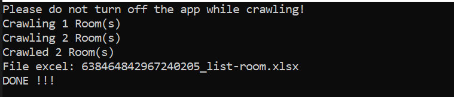

# RentalRoomCrawler

Writing a web data crawler tool can be a challenging task, but it can be a rewarding one.

## Overview

RentalRoomCrawler is a declarative high performance web scraper, crawler and parser in C#. Designed as simple, extensible and
scalable web scraping solution.



## Requirements

.NET 8

## Features

* High crawling speed due to parallelism and asynchrony
* Saving data to database
* Include download image file
* Export Excel file

## Usage

### Program.cs

Config connectionString for your database.

```C#
const string connectionString = "server=localhost;uid=root;pwd=mysql;database=rental_room";
```

You can change number of items for select.

```C#
// Crawl data 
var dataCrawl = tool.Crawling(30);
```

### Model

```C#
public class Room
{
    [Description("Tên chủ trọ")]
    public string OwnerName { get; set; }

    [Description("Tiêu đề")]
    public string Title { get; set; }

    [Description("Mô tả")]
    public string Description { get; set; }

    [Description("Diện tích")]
    public string Area { get; set; }

    [Description("Số điện thoại")]
    public string Phone { get; set; }

    [Description("Giá cho thuê")]
    public string Price { get; set; }

    [Description("Địa chỉ")]
    public string Address { get; set; }

    [Description("Hình ảnh")]
    public string Image { get; set; }
}
```
### Crawler
```C#
public class Crawler
{
    private const string BaseUrl = "https://phongtro123.com";

    private readonly string _savePathImage;

    public Crawler(string savePathImage)
    {
        _savePathImage = savePathImage;
    }

    public List<Room> Crawling(int stopRoom = 1)
    {
        var dataCrawl = new List<Room>();
        var count = 0;

        var web = new HtmlWeb()
        {
            AutoDetectEncoding = false,
            OverrideEncoding = Encoding.UTF8
        };

        for (int i = 1; i <= 5000; i++)
        {
            var requestPerPage = BaseUrl + $"?page={i}";
            var documentForListItem = web.Load(requestPerPage);

            var listNodeRoomItem = documentForListItem
                .GetMultiNode("h3.post-title > a");

            foreach (var href in listNodeRoomItem)
            {
                if (dataCrawl.Count == stopRoom) return dataCrawl;
                var detailLink = href.Attributes["href"].Value;

                if (!string.IsNullOrEmpty(detailLink))
                {
                    var documentForDetail = web.Load(BaseUrl + detailLink);

                    if (documentForDetail != null)
                    {
                        var roomOwnerName = documentForDetail.GetSingleNode("#aside > div > span.author-name").GetInnerText();
                        var roomTitle = documentForDetail.GetSingleNode("h1.page-h1 > a").GetInnerText();
                        var roomDescription = documentForDetail.GetSingleNode("section.post-main-content > div.section-content").GetInnerText();
                        var roomArea = documentForDetail.GetSingleNode("div.acreage > span").GetInnerText().ReplaceMultiToEmpty(new List<string>() { "m2" });
                        var roomPhone = documentForDetail.GetSingleNode("#aside > div > a.btn.author-phone")?.GetInnerText();
                        var roomPrice = documentForDetail.GetSingleNode("div.price > span").GetInnerText().ReplaceMultiToEmpty(new List<string>() { " triệu/tháng", " đồng/tháng" });
                        var roomAddress = documentForDetail.GetSingleNode("span.post-fix-bar-address").GetInnerText();

                        var roomImageNode = documentForDetail.GetSingleNode("div.swiper-slide > img");
                        var src = roomImageNode.Attributes["src"].Value;
                        var roomImage = DateTime.Now.Ticks + ".png";
                        var pathReturn = DownloadHelper.DownloadImageFromUri(src, _savePathImage + roomImage);

                        var room = new Room()
                        {
                            OwnerName = roomOwnerName,
                            Title = roomTitle,
                            Description = roomDescription,
                            Area = roomArea,
                            Phone = roomPhone,
                            Price = roomPrice,
                            Address = roomAddress,
                            Image = roomImage,
                        };
                        dataCrawl.Add(room);
                    }
                }
                count++;
                Console.WriteLine($"Crawling {count} Room(s)");
            }
        }

        return null;
    }
}
```

### Repository
```C#
public class RoomRepository
{

    /// <summary>
    /// 
    /// This class is used for insert data to Database
    /// 
    /// </summary>
    public async Task<bool> InsertRoomAsync(Room? data, MySqlConnection connection)
    {
        try
        {
            MySqlCommand comm = connection.CreateCommand();
            comm.CommandText = "INSERT INTO rooms (owner_name, title, description, area, phone, price, address, image, is_active, user_id)"
                            + "VALUES(@owner_name, @title, @description, @area, @phone, @price, @address, @image, @is_active, @user_id)";
            comm.Parameters.AddWithValue("@owner_name", data.OwnerName);
            comm.Parameters.AddWithValue("@title", data.Title);
            comm.Parameters.AddWithValue("@description", data.Description);
            comm.Parameters.AddWithValue("@area", data.Area);
            comm.Parameters.AddWithValue("@phone", data.Phone);
            comm.Parameters.AddWithValue("@price", data.Price);
            comm.Parameters.AddWithValue("@address", data.Address);
            comm.Parameters.AddWithValue("@image", data.Image);
            comm.Parameters.AddWithValue("@is_active", true);
            comm.Parameters.AddWithValue("@user_id", 1);

            return comm.ExecuteNonQuery() > 0;
        }
        catch (Exception e)
        {
            throw;
        }
    }
}
```

## Authors

© 2023 Nguyen Anh Duc - ducna0610

## License

This project is licensed under the MIT License - see the [LICENSE.txt](LICENSE.txt) file for details